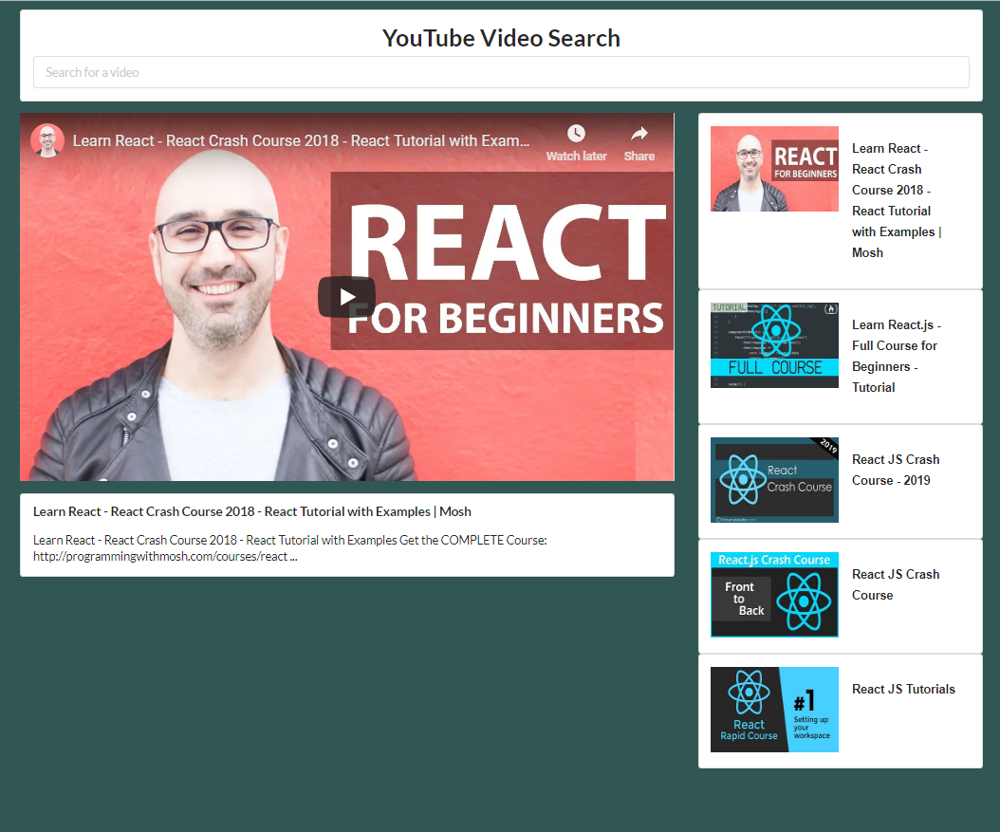

## YouTube Browswer

This objective of this app was to search via the YouTube API, display the top 5 results, and play the video without ever leaving the page. This was complete using React and CSS.

